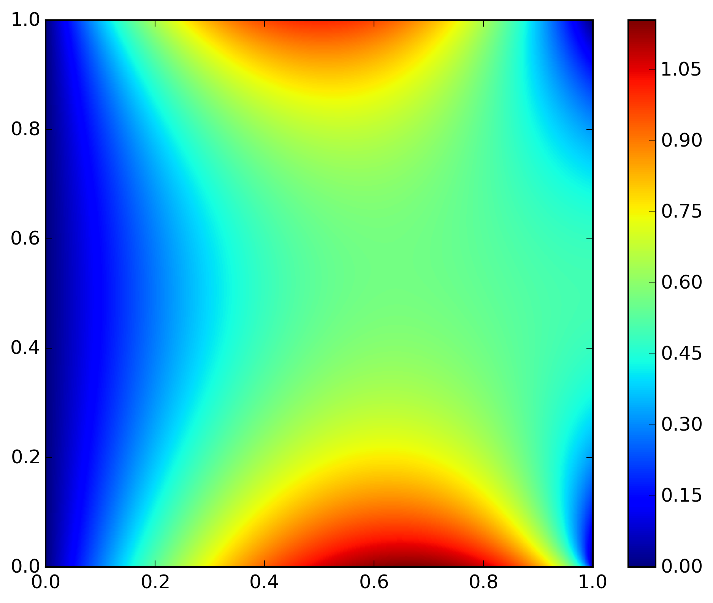

# laplace-2D
The fortran code to solve Laplace (or Poisson) equation in 2D
on the rectangular grid.

The code solves the equation u_{xx} + u_{yy} = f(x, y)
with the value of u(x, y) defined on the domain boundary.

